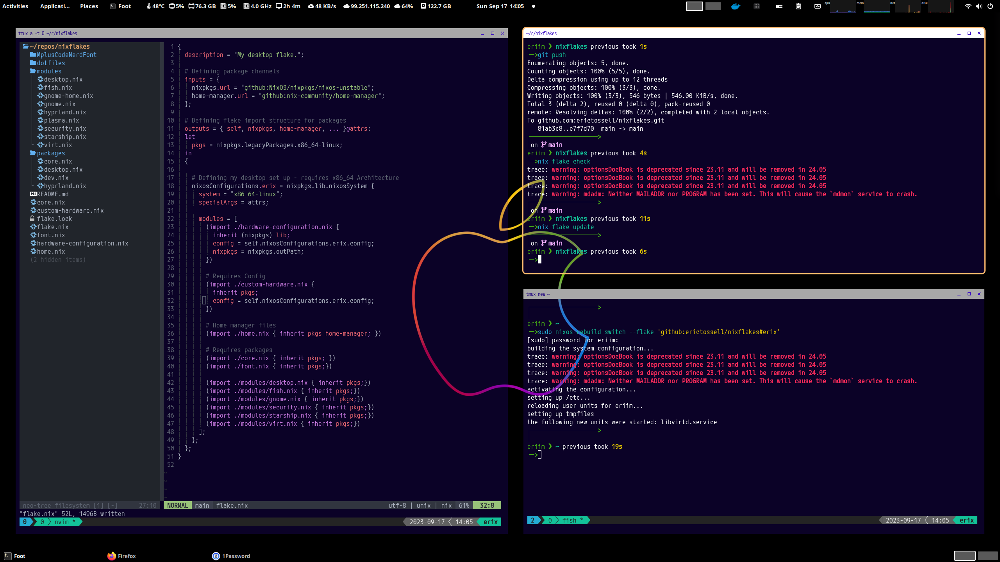

## Eriim's Nixflakes

### This repo has not been fully flaked yet and these are *machine specific flakes*. You WILL run into errors if you attempt to flake from this repo and you are not using my machines.

### Fully flaked modules are a WIP.

Nixflakes are an "experimental" feature in NixOS that allow defining very specific package or patching requirements. They can also be used to manage a set of configurations and allow shared Nix modules between them. This makes it very easy to setup a desktop, laptop, and server using common core packages but still maintaining their own hardware and utility specific configurations.

#### Considerations with Flakes
- Using Flakes will unpin you from the channels you were previously using. This is not suitable for all users but will generally provide a more producable and reliable environment. 

- Flakes are generally a "different" way of doing things. You must pass the package and system configuration down into the flakes unless they are being overriden which is a separate mechanic.


### Flakes for Git integration Nix and Configuration Testing
By using flakes you can effectively build and test your configurations in a normal repository in your file structure as opposed to editing /etc/nixos. This is highly preferable and reduces the volume of sudo commands required to test your configuration. 

Testing a flake is a simple as: 
```nix
nix flake check
```

Updating a flake:
```nix
nix flake update
```

#### Using Flakes

Two experimental features must be enabled to use nix flakes on your system: nix-commands & flakes

The can be enabled by adding the following line to your configuration.nix:

```nix

 nix.settings.experimental-features = [ "nix-command" "flakes" ];

```

### Using my Nixflakes Repo

To install a system configuration from my Nixflakes you can run the following command:

```bash

sudo nixos-rebuild switch --flake 'github:erictossell/nixflake#erix'

```

### My Nixdots contain set ups for:

- Desktop (erix)
    - DE: Customized Gnome w PopShell for a WM experience
    - Editor: Neovim
    - IDE: VSCode
    - Terminal: Foot
    - Browser(s): Firefox, Chromium, Nyxt
    - 1Password for SSH Authentication
    - Yubico Key 2FA

I use gnome-shell on my desktop NixOS machine. To read my Gnome specific configurations you can navigate to:

## Gnome

I use a highly customized Gnome desktop environment with Popshell for window management. This involves modifying a number of default mutter settings and it managed on a per user basis. This means we have to involve home-manager to accomplish this.

#### Gnome Screenshot


To see my nixdots without requiring flakes you can check out my configuration here for my gnome desktop:

[Enable Gnome](https://github.com/erictossell/nixdots/blob/main/desktop/modules/gnome.nix)

[Customize Gnome with Home-Manager](https://github.com/erictossell/nixdots/blob/main/desktop/modules/gnome-home.nix)

###### Disabling Hyprland
Enabling Gnome does require disabling Hyprland due to conflicts with differing XDG portals. Hopefully this will be fixed in the near future.

Thanks to the nature of NixOS this is trivial and the two modes can be interchanged reliably. 

Doing this often will have an impact on your SSD lifetime.


