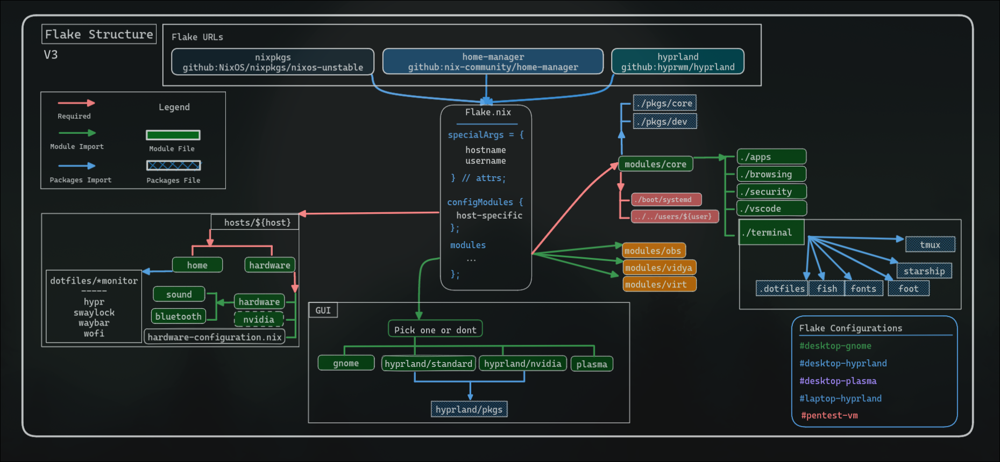

> :warning: **Disclaimer:** These are *machine specific flakes*. You *WILL* run into errors if you attempt to flake from this repo and you are not using my machines.

## Eriim's Nixflakes

Modules are grouped to be almost purely *functional* and as a result you will often find both the system configuration and the home-manager configuration in the same place. Not all Nix users will this paradigm.

Some modules will require you to flake your configuration to fully use them, they have non-flaked counterparts. 

Requires Flake:

- [modules/gui/hyprland/nvidia](https://github.com/erictossell/nixflakes/blob/main/modules/gui/hyprland/nvidia/default.nix)

Non Flake alternative (Still contains Nvidia Optional Settings):

- [modules/gui/hyprland/standard](https://github.com/erictossell/nixflakes/blob/main/modules/gui/hyprland/standard/default.nix)



### To Be Done

- SOPS for nixsecrets

## Screenshots


### My Nixdots Contain Configurations for

#### Core Modules
  - Browsers (Firefox, Chrome, Nyxt)
  - Nvidia
  - [OBS Studio](https://obsproject.com/) (for screen recording and streaming/sharing screen)
  - Security Config ([1Password](https://1password.com/), [Yubico](https://www.yubico.com/) Authentication)

#### Extra Toys
- Vidya (Steam, Wine)
- Virt (Docker, kvm/qemu)

#### Terminal Module
  - Editor: [`nvim`](https://neovim.io/), `vim`
  - Terminals: [`foot`](https://codeberg.org/dnkl/foot), [`alacritty`](https://github.com/alacritty/alacritty), [`wezterm`](https://wezfurlong.org/wezterm/index.html)
  - Shell: `bash`
  - [`btop` (Resource Monitoring)](https://github.com/aristocratos/btop)
  - [`cava` (Music Visualizer)](https://github.com/karlstav/cava)
  - [`nitch` (sysfetch)](https://github.com/ssleert/nitch)

#### Profiles
1. Desktop (retis) - 3 monitors

   - WM: [hyprland](https://hyprland.org/)
   - All core modules + nvidia

2. Laptop (sisyphus) - 1 monitor

   - WM: [hyprland](https://hyprland.org/)
   - Most core modules (no extra toys)

3. Laptop (icarus) - 1 monitor

   - WM: [hyprland](https://hyprland.org/)
   - Most core modules (no extra toys)

4. PentestVM (aeneas)

   - Specialised set of packages for playing [HTB](https://www.hackthebox.com/)

5. Desktop (desktop-gnome) 

   - DE: Customised [Gnome](https://www.gnome.org/) w [PopShell](https://github.com/pop-os/shell) for a WM experience
   - All core modules + nvidia

6. Desktop (desktop-plasma)

   - DE: [KDE Plasma](https://kde.org/plasma-desktop/)
   - All core modules + nvidia

## Getting Started with NixOS Minimal

You've done an initial install from a minimal image because the GUI is no fun, what now?

### 1. Connect to the Internet

   a. Discover your wireless interface if you're not using ethernet.

   ```bash
      ip link show
   ```

   b. Initialise your `wpa_supplicant` with one of the following, run these commands with sudo privileges:

   ```bash
      wpa_supplicant -B -i (your-interface-name) -c <(wpa_passphrase "SSID" "password")
   ```

   OR - in the default NixOS installation home directory

   ```bash
      wpa_passphrase "SSID" "password" > temp_wpa.conf

      wpa_supplicant -B -i (your-interface-name) -c ~/temp_wpa.conf
   ```

   `pkill wpa_supplicant` between any failed attempts to connect to the internet. Remember to `rm temp_wpa.conf` after successfully connecting.

### 2. Generate Your Hardware Specific .nix

   a. Generate a basic configuration.nix and hardware-configuration.nix

   ```bash
      nixos-generate-config
   ```

   b. Edit your configuration.nix with nano or wget a configuration.nix from the internet *at your own risk*.

   - Make sure to include a user and an internet connection method.
   - Add your preferred text editor to the pkgs list.
   - (Optionally) Add any programs and services you know you will need from the get go. There is not need to incrementally build your system but it's easier to figure out what's going wrong if you go slow.
   - Save your changes.

### 3. `nixos-rebuild boot` To Launch NixOS for the First time
