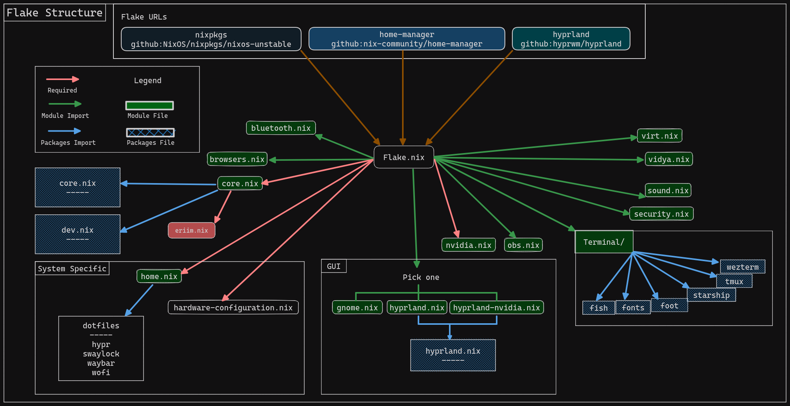
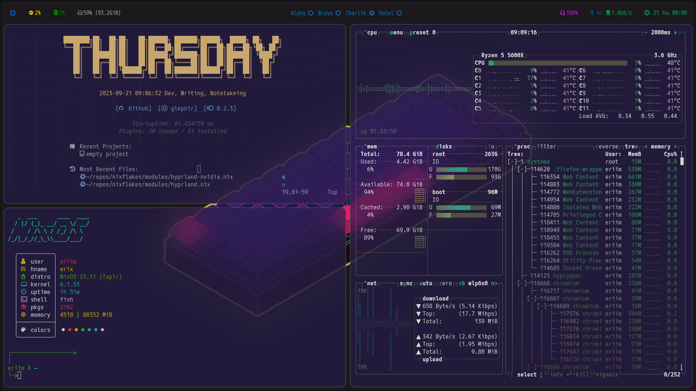
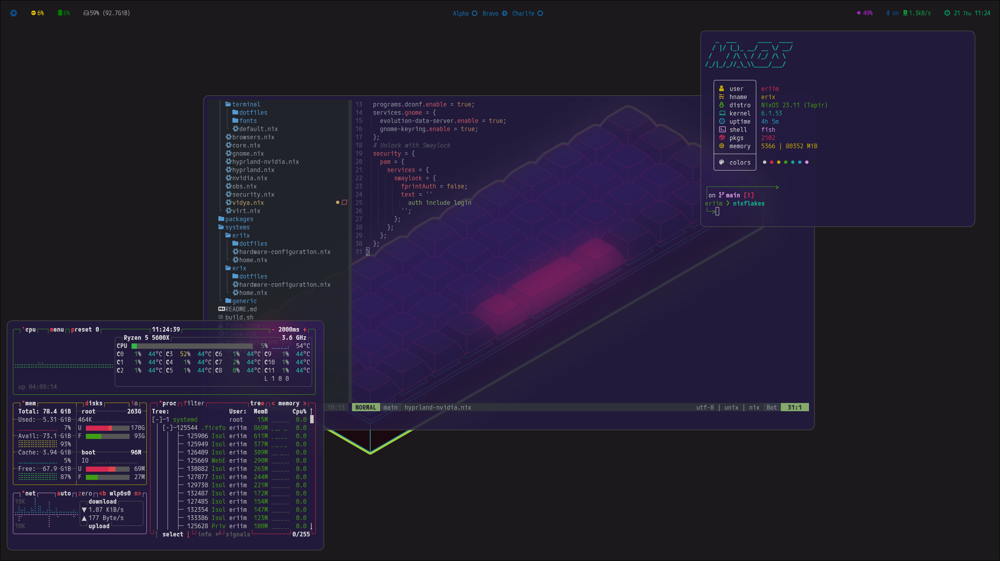
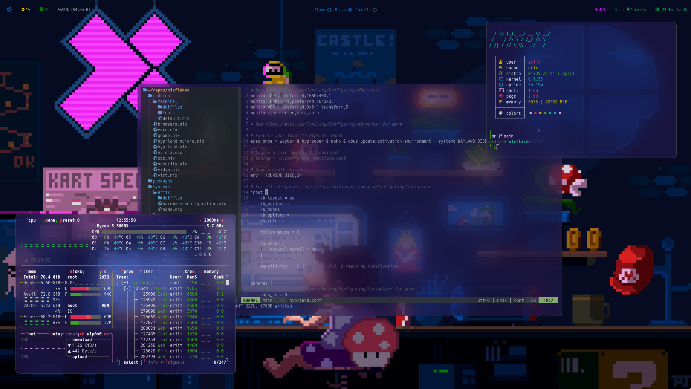

> :warning: **Disclaimer:** These are *machine specific flakes*. You *WILL* run into errors if you attempt to flake from this repo and you are not using my machines.

## Eriim's Nixflakes

This repo contains pure nix modules that can be imported to other Nix systems using a similar configuration. 

Modules are grouped by *functionality* and as such you will often find both the system configuration and the home-manager configuration in the same place. Not all Nix users will use this paradigm.

Some modules have accompanying packages - they contain required or reccomended accompanying packages.
- [/packages/hyprland.nix](https://github.com/erictossell/nixflakes/blob/main/packages/hyprland.nix)

Some modules will require you to flake your configuration to fully use them, they have non-flaked counterparts. This includes:

Requires Flake:

- [hyprland-nvidia.nix](https://github.com/erictossell/nixflakes/blob/main/modules/hyprland-nvidia.nix)

Non Flake alternative:

- [hyprland.nix](https://github.com/erictossell/nixflakes/blob/main/modules/hyprland.nix)




### To be done 

- SOPS for nixsecrets

## Screenshots 





### My Nixdots contain configurations for:

##### Core Modules

  - Browser(s): Firefox, Chromium, Nyxt 
  - IDE: VSCode

##### Security : 

  Security modules require additional set up beyond what is included in this repo.
  Refer to the NixOS wiki for further documentation
  - 1Password for SSH Authentication
  - Yubico Key 2FA

##### Terminal Module 

  - Editor: Neovim
  - Fonts
  - Terminals: Foot, alacritty, wezterm   

##### Profiles

1. Desktop (erix-hyprland)

   - WM: hyprland
   - All core modules + nvidia

2. Desktop (erix-gnome)

   - DE: Customized Gnome w PopShell for a WM experience
   - All core modules + nvidia

3. Laptop (eriix) [ Slightly stripped down version of my desktop ]

   - WM: hyprland
   - Most core modules (no virt)   

4. TBD (server farm) 

   My Nix home server is WIP.

## Getting started with NixOS Minimal

You've done an initial install from a minimal image because the GUI is no fun, what now?

#### 1. Connnect to the internet
   a. Discover your wireless interface if you're not using ethernet.
   
   ```bash
      ip link show
   ```
   
   b. Initialize your `wpa_supplicant` with one of the following, run these commands with sudo privileges:

   ```bash
      wpa_supplicant -B -i (your-interface-name) -c <(wpa_passphrase "SSID" "password")
   ```

   OR - in the default NixOS installation home directory

   ```bash
      wpa_passphrase "SSID" "password" > temp_wpa.conf

      wpa_supplicant -B -i (your-interface-name) -c ~/temp_wpa.conf
   ```
   
   `pkill wpa_supplicant` between any failed attempts to connect to the internet. Remember to `rm temp_wpa.conf` after successfully connecting.

#### 2. Generate your hardware specific .nix
   a. Generate a basic configuration.nix and hardware-configuration.nix
   ```bash
      nixos-generate-config
   ```

   b. Edit your configuration.nix with nano or wget a configuration.nix from the internet *at your own risk*. 

   - Make sure to include a user and an internet connection method.
   - Add your prefered text editor to the pkgs list. 
   - (Optionally) Add any programs and services you know you will need from the get go. There is not need to incrementally build your system but it's easier to figure out what's going wrong if you go slow.
   - Save your changes.
  
#### 3. `nixos-rebuild boot` to launch NixOS for the first time. 
