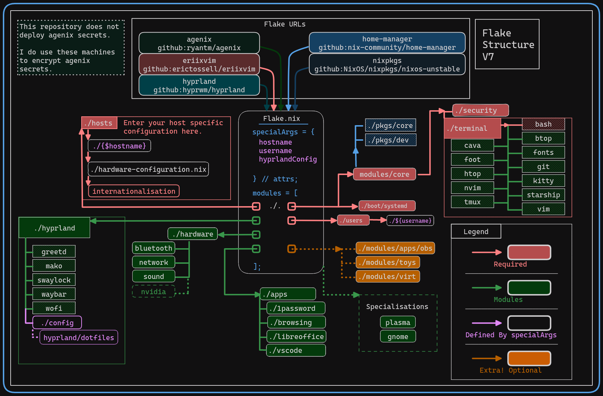
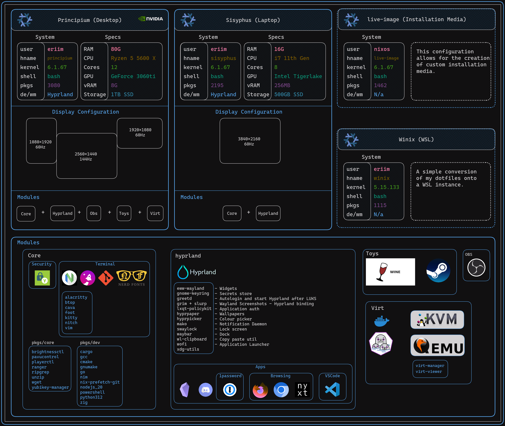
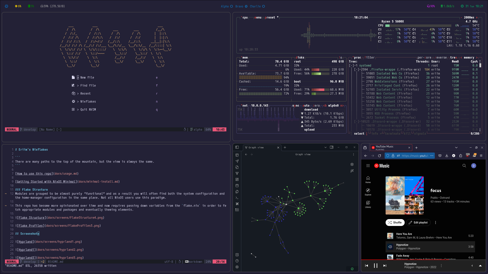
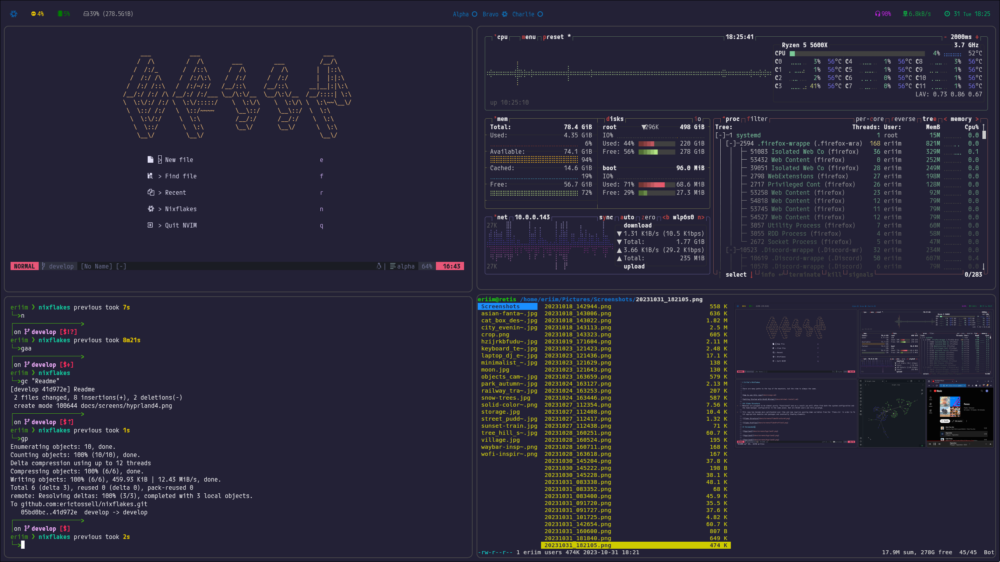
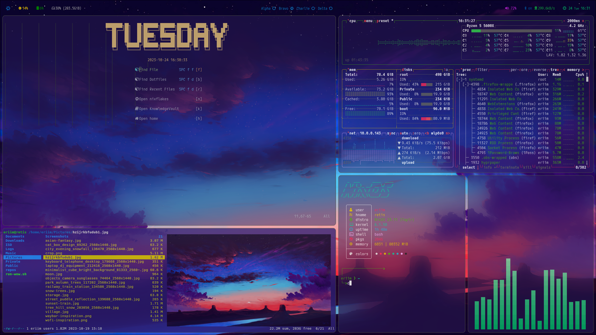
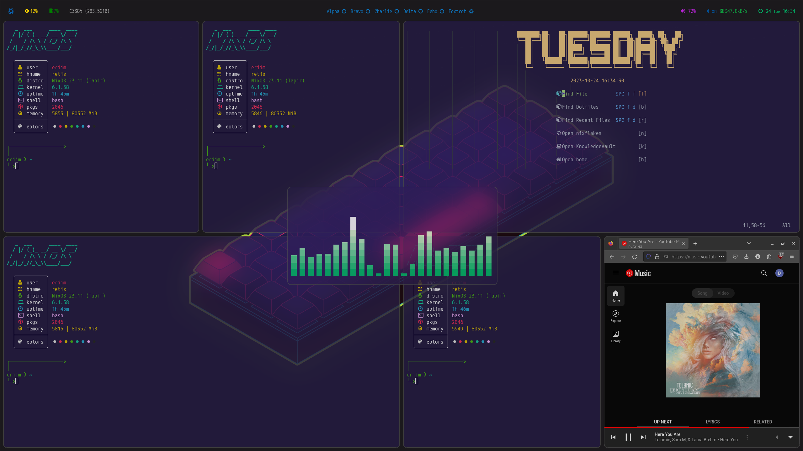
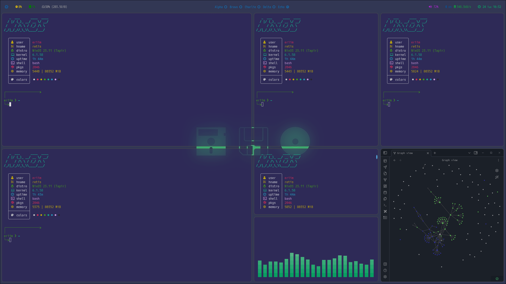

I like simple things, so you may find that there is not all that much complex going on in this repository. I do not build any of my own packages or make extreme modifications to any of the example configurations I have found online that make up this motley crew of `.nix`. What I can say, is that the main branch of this configuration is relatively thoroughly tested.

I am not an authority on `Nix` or `NixOS`. I am merely an apprentice, an *Alice* navigating the *wonderland*. At least for now.

So anyways. Here's my dots. I hope you like them.

# Eriim's Nixflakes

```
There are many paths to the top of the mountain, but the view is always the same.
```

[How to use this repo](docs/usage.md)

[Getting Started with NixOS Minimal](docs/minimal-install.md)

### Flake Structure
Modules are grouped to be ***almost*** purely *functional* and as a result you will often find both the system configuration and the home-manager configuration in the same place. Not all NixOS users use this paradigm.

This repo has become more opinionated over time and now requires passing down variables from the `flake.nix` in order to fetch appropriate modules and packages and eventually theming elements. 

### Flake Github URLS

Transparency is cool.

[nixpkgs: nixos-unstable](https://github.com/NixOS/nixpkgs)

[home-manager: following nixpkgs](https://github.com/nix-community/home-manager/blob/master/flake.nix)

[agenix: following nixpkgs](https://github.com/ryantm/agenix/blob/main/flake.nix)

[hyprland](https://github.com/hyprwm/Hyprland/blob/main/flake.nix)

[eriixvim: my nixvim flake](https://github.com/erictossell/eriixvim/blob/main/flake.nix)

[ruSSH: a simple SSH multiplier](https://github.com/erictossell/russh/blob/main/flake.nix)

### Diagrams





## Screenshots

Current 
------



October 2023
------






### My Nixdots Contain Configurations for

#### Core Modules
- Boot
- Security Config ([Yubico](https://www.yubico.com/) Authentication)
  ##### Terminal Module
  - Editor: [`nvim`](https://neovim.io/), `vim`
  - Terminals: [`foot`](https://codeberg.org/dnkl/foot), [`alacritty`](https://github.com/alacritty/alacritty), [`wezterm`](https://wezfurlong.org/wezterm/index.html)
  - Shell: `bash`
  - [`btop` (Resource Monitoring)](https://github.com/aristocratos/btop)
  - [`cava` (Music Visualizer)](https://github.com/karlstav/cava)
  - [`nitch` (sysfetch)](https://github.com/ssleert/nitch)

#### Hyprland
- [Dotfiles](modules/hyprland/config/)
- [greetd](modules/hyprland/greetd/default.nix)
- [mako](modules/hyprland/mako/default.nix)
- [swaylock](modules/hyprland/swaylock/default.nix)
- [waybar](modules/hyprland/waybar/default.nix)
- [wofi](modules/hyprland/wofi/default.nix)

#### Apps
- [1Password](https://1password.com/)
- Browsers (Firefox, Chrome, Nyxt)
- [Discord](https://discord.com)
- [Obsidian](https://obsidian.md/)
- [VSCode](https://code.visualstudio.com/)

#### Extra Toys
- [OBS Studio](https://obsproject.com/) (for screen recording and streaming/sharing screen)
- Vidya (Lutris, Steam, Wine)

- Virt (Docker, Podman, kvm/qemu)

#### Configurations
1. Desktop (principium) - 3 monitors

   - WM: [hyprland](https://hyprland.org/)
   - All core modules + nvidia

2. Laptop (sisyphus) - 1 monitor

   - WM: [hyprland](https://hyprland.org/)
   - Most core modules (no extra toys)

3. Live Boot Image (live-image)

   - A customized minimal boot example.

[How to use this repo](docs/usage.md)

[Getting Started with NixOS Minimal](docs/minimal-install.md)
