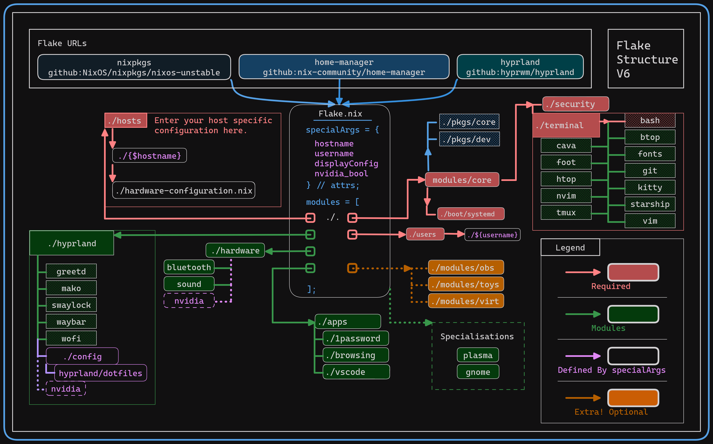
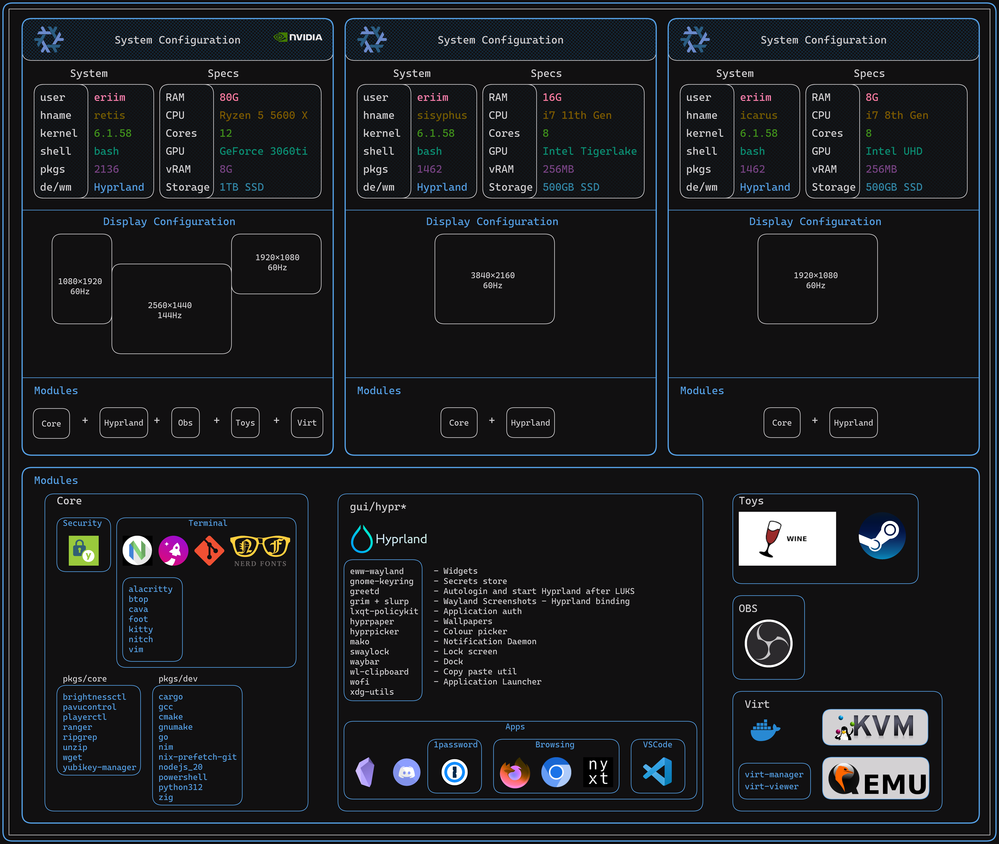

# Eriim's Nixflakes

```
There are many paths to the top of the mountain, but the view is always the same.
```

[How to use this repo](docs/usage.md)

[Getting Started with NixOS Minimal](docs/minimal-install.md)

### Flake Structure
Modules are grouped to be almost purely *functional* and as a result you will often find both the system configuration and the home-manager configuration in the same place. Not all NixOS users use this paradigm.

This repo has become more opinionated over time and now requires passing down variables from the `flake.nix` in order to fetch appropriate modules and packages and eventually theming elements. 





## Screenshots

Current 
------


October 2023
------


### My Nixdots Contain Configurations for

#### Core Modules
- Boot
- Security Config ([Yubico](https://www.yubico.com/) Authentication)
  ##### Terminal Module
  - Editor: [`nvim`](https://neovim.io/), `vim`
  - Terminals: [`foot`](https://codeberg.org/dnkl/foot), [`alacritty`](https://github.com/alacritty/alacritty), [`wezterm`](https://wezfurlong.org/wezterm/index.html)
  - Shell: `bash`
  - [`btop` (Resource Monitoring)](https://github.com/aristocratos/btop)
  - [`cava` (Music Visualizer)](https://github.com/karlstav/cava)
  - [`nitch` (sysfetch)](https://github.com/ssleert/nitch)

#### Hyprland
- [Dotfiles](modules/hyprland/config/)
- [greetd](modules/hyprland/greetd/default.nix)
- [mako](modules/hyprland/mako/default.nix)
- [swaylock](modules/hyprland/swaylock/default.nix)
- [waybar](modules/hyprland/waybar/default.nix)
- [wofi](modules/hyprland/wofi/default.nix)

#### Apps
- [1Password](https://1password.com/)
- Browsers (Firefox, Chrome, Nyxt)
- [Discord](https://discord.com)
- [Obsidian](https://obsidian.md/)
- [VSCode](https://code.visualstudio.com/)

#### Extra Toys
- [OBS Studio](https://obsproject.com/) (for screen recording and streaming/sharing screen)
- Vidya (Steam, Wine)
- Virt (Docker, kvm/qemu)

#### Configurations
1. Desktop (retis) - 3 monitors

   - WM: [hyprland](https://hyprland.org/)
   - All core modules + nvidia

2. Laptop (sisyphus) - 1 monitor

   - WM: [hyprland](https://hyprland.org/)
   - Most core modules (no extra toys)

3. Laptop (icarus) - 1 monitor

   - WM: [hyprland](https://hyprland.org/)
   - Most core modules (no extra toys)

### To Be Done

- sops-nix/agenix for nixsecrets

[How to use this repo](docs/usage.md)

[Getting Started with NixOS Minimal](docs/minimal-install.md)
