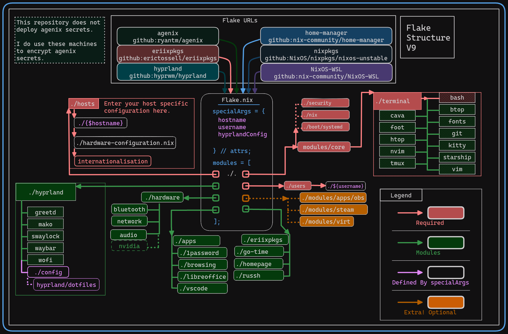

> :warning: **I am not an authority on `Nix` or `NixOS`. I am merely an apprentice, an *Alice* navigating the *wonderland*. At least for now.**

So anyways. Here's my dots. I hope you like them.


# Eriim's Nixflakes

[](https://github.com/erictossell/nixflakes/actions/workflows/flake_check.yml)

```
There are many paths to the top of the mountain, but the view is always the same.
```

<details>
<summary> 📚 Docs </summary>

[Why Nix and NixOS](docs/why-nix.md)

[Getting Started with NixOS Minimal](docs/minimal-install.md)

[How to use this repo](docs/usage.md)

[NixOS as a Hypervisor](docs/hypervisor.md)

[Keybindings Implemented by this Configuration](docs/keybinds.md) 

If you have questions you are welcome to send them in the form of an [issue](https://github.com/erictossell/nixflakes/issues/new) or reach me at any of my other points of contact available on my [GitHub Profile](https://github.com/erictossell) - I make no guarantees but I'm happy to do my best.

</details>

<details>
<summary>📁 What is in this repo?</summary>

1. A [modular](https://github.com/erictossell/nixflakes/blob/main/docs/screens/FlakeStructure9.png) (opinionated) Configuration Structure

2. Flake templates - Quickly grab this configuration and make it your own with:

```nix
nix flake new -t github:erictossell/nixflakes ./<your-repo-name-here>
```

3. An interactive build script for adding new [`hosts`](https://github.com/erictossell/nixflakes/tree/main/hosts)/[`users`](https://github.com/erictossell/nixflakes/tree/main/users) at [`sh/build.sh`](https://github.com/erictossell/nixflakes/blob/main/sh/build.sh)

4. [`eriixvim`](https://github.com/erictossell/eriixvim) - a fully reproducible neovim configuration built with [`nixvim`](https://github.com/nix-community/nixvim).

Try it out with:

```nix
nix run github:erictossell/eriixvim
```

5. A simple example of a custom built `rust` package: [`russh`](https://github.com/erictossell/russh). 

The highlight being how simple it is to package any application with `flakes` and import them into a `configuration` and ***not*** my `rust` code.

6. Semi up-to-date diagrams of the [structure](https://github.com/erictossell/nixflakes/blob/main/docs/screens/FlakeStructure9.png) of this flake and the [configurations](https://github.com/erictossell/nixflakes/blob/main/docs/screens/FlakeProfiles9.png) managed by [me](https://github.com/erictossell).

7. `nix flake show github:erictossell/nixflakes` 

```nix
github:erictossell/nixflakes/bbca96ce85416b025d652d752c87d3816b2bf8ad
├───devShells
│   └───x86_64-linux
│       └───default: development environment 'nix-shell'
├───formatter
│   └───x86_64-linux: package 'nixpkgs-fmt-1.3.0'
├───nixosConfigurations
│   ├───ambiens: NixOS configuration
│   ├───live-image: NixOS configuration
│   ├───principium: NixOS configuration
│   ├───sisyphus: NixOS configuration
│   ├───virtualis: NixOS configuration
│   └───winix: NixOS configuration
└───templates
    └───default: template: The default template for Eriim's nixflakes.
```

8. [Nix CI/CD with Github Actions](https://github.com/erictossell/nixflakes/blob/main/.github/workflows/flake_check.yml) - Built with: [Cachix - Install Nix](https://github.com/cachix/install-nix-action), [Determiniate Systems - Flake Check](https://github.com/DeterminateSystems/flake-checker-action), [stefanzweifel - Commit Action](https://github.com/stefanzweifel/git-auto-commit-action), [statix](https://github.com/nerdypepper/statix), [nixpkgs-fmt](https://github.com/nix-community/nixpkgs-fmt)

</details>

## Flake Structure
Modules are grouped to be ***almost*** purely *functional* and as a result you will often find both the system configuration and the home-manager configuration in the same place. Not all NixOS users use this paradigm.

This repo has become more opinionated over time and now requires passing down variables from the `flake.nix` in order to fetch appropriate `host` and `user` specific configurations for a given device.

<details>
<summary> Generated Flake Information </summary>


### Flake Info

```nix
Resolved URL:  git+file:///home/runner/work/nixflakes/nixflakes?shallow=1
Locked URL:    git+file:///home/runner/work/nixflakes/nixflakes?ref=66d0e97fff9ee164a6070ca9f8fdc0a8aeee1284&rev=66d0e97fff9ee164a6070ca9f8fdc0a8aeee1284&shallow=1
Description:   Eriim's machine specific configuration flake.
Path:          /nix/store/8s6kwvj0qrl06hc45qybqmsmlxwg3gib-source
Revision:      66d0e97fff9ee164a6070ca9f8fdc0a8aeee1284
Last modified: 2024-02-28 17:35:56
Inputs:
├───NixOS-WSL: github:nix-community/NixOS-WSL/7e3fc6a99a2c9e6701e2e0d37f1755e29a798b91
│   ├───flake-compat: github:edolstra/flake-compat/0f9255e01c2351cc7d116c072cb317785dd33b33
│   ├───flake-utils: github:numtide/flake-utils/1ef2e671c3b0c19053962c07dbda38332dcebf26
│   │   └───systems: github:nix-systems/default/da67096a3b9bf56a91d16901293e51ba5b49a27e
│   └───nixpkgs follows input 'nixpkgs'
├───agenix: github:ryantm/agenix/8cb01a0e717311680e0cbca06a76cbceba6f3ed6
│   ├───darwin follows input ''
│   ├───home-manager: github:nix-community/home-manager/3bfaacf46133c037bb356193bd2f1765d9dc82c1
│   │   └───nixpkgs follows input 'agenix/nixpkgs'
│   ├───nixpkgs follows input 'nixpkgs'
│   └───systems: github:nix-systems/default/da67096a3b9bf56a91d16901293e51ba5b49a27e
├───eriixpkgs: github:erictossell/eriixpkgs/7ac031e146cfee8a0d2806886abbb2a21651d748
│   ├───eriixvim: github:erictossell/eriixvim/998a3c8704890cf77591cefd3551c734734c130d
│   │   ├───flake-parts: github:hercules-ci/flake-parts/b253292d9c0a5ead9bc98c4e9a26c6312e27d69f
│   │   │   └───nixpkgs-lib: github:NixOS/nixpkgs/97b17f32362e475016f942bbdfda4a4a72a8a652?dir=lib
│   │   ├───nixpkgs: github:nixos/nixpkgs/f9d39fb9aff0efee4a3d5f4a6d7c17701d38a1d8
│   │   └───nixvim: github:nix-community/nixvim/183eac72a9f0ae0032239510d89dbc474b180d33
│   │       ├───flake-parts: github:hercules-ci/flake-parts/b253292d9c0a5ead9bc98c4e9a26c6312e27d69f
│   │       │   └───nixpkgs-lib follows input 'eriixpkgs/eriixvim/nixvim/nixpkgs'
│   │       ├───home-manager: github:nix-community/home-manager/5b9156fa9a8b8beba917b8f9adbfd27bf63e16af
│   │       │   └───nixpkgs follows input 'eriixpkgs/eriixvim/nixvim/nixpkgs'
│   │       ├───nix-darwin: github:lnl7/nix-darwin/bdbae6ecff8fcc322bf6b9053c0b984912378af7
│   │       │   └───nixpkgs follows input 'eriixpkgs/eriixvim/nixvim/nixpkgs'
│   │       ├───nixpkgs: github:NixOS/nixpkgs/f8e2ebd66d097614d51a56a755450d4ae1632df1
│   │       └───pre-commit-hooks: github:cachix/pre-commit-hooks.nix/0db2e67ee49910adfa13010e7f012149660af7f0
│   │           ├───flake-compat: github:edolstra/flake-compat/0f9255e01c2351cc7d116c072cb317785dd33b33
│   │           ├───flake-utils: github:numtide/flake-utils/4022d587cbbfd70fe950c1e2083a02621806a725
│   │           │   └───systems: github:nix-systems/default/da67096a3b9bf56a91d16901293e51ba5b49a27e
│   │           ├───gitignore: github:hercules-ci/gitignore.nix/43e1aa1308018f37118e34d3a9cb4f5e75dc11d5
│   │           │   └───nixpkgs follows input 'eriixpkgs/eriixvim/nixvim/pre-commit-hooks/nixpkgs'
│   │           ├───nixpkgs follows input 'eriixpkgs/eriixvim/nixvim/nixpkgs'
│   │           └───nixpkgs-stable follows input 'eriixpkgs/eriixvim/nixvim/nixpkgs'
│   ├───flake-utils: github:numtide/flake-utils/1ef2e671c3b0c19053962c07dbda38332dcebf26
│   │   └───systems: github:nix-systems/default/da67096a3b9bf56a91d16901293e51ba5b49a27e
│   ├───go-time: github:erictossell/go-time/d2e5a8c286fde94478e16a597bc78b6954e3b9a8
│   │   └───nixpkgs: github:NixOS/nixpkgs/c3e128f3c0ecc1fb04aef9f72b3dcc2f6cecf370
│   ├───homepage-nix: github:erictossell/homepage-nix/7895b342647955e8572363bbbfb331d15255dd48
│   │   ├───naersk: github:nix-community/naersk/aeb58d5e8faead8980a807c840232697982d47b9
│   │   │   └───nixpkgs: github:NixOS/nixpkgs/e5d1c87f5813afde2dda384ac807c57a105721cc
│   │   ├───nixpkgs: github:NixOS/nixpkgs/e5d1c87f5813afde2dda384ac807c57a105721cc
│   │   └───utils: github:numtide/flake-utils/1ef2e671c3b0c19053962c07dbda38332dcebf26
│   │       └───systems: github:nix-systems/default/da67096a3b9bf56a91d16901293e51ba5b49a27e
│   ├───nixpkgs follows input 'nixpkgs'
│   ├───readme-py: github:erictossell/readme-py/b04ef6299281dc2cf15f889135c16ea6a7aaaa4b
│   │   ├───flake-utils: github:numtide/flake-utils/1ef2e671c3b0c19053962c07dbda38332dcebf26
│   │   │   └───systems: github:nix-systems/default/da67096a3b9bf56a91d16901293e51ba5b49a27e
│   │   ├───nixpkgs: github:NixOS/nixpkgs/cbc4211f0afffe6dfd2478a62615dd5175a13f9a
│   │   └───poetry2nix: github:nix-community/poetry2nix/3c92540611f42d3fb2d0d084a6c694cd6544b609
│   │       ├───flake-utils: github:numtide/flake-utils/1ef2e671c3b0c19053962c07dbda38332dcebf26
│   │       │   └───systems: github:nix-systems/default/da67096a3b9bf56a91d16901293e51ba5b49a27e
│   │       ├───nix-github-actions: github:nix-community/nix-github-actions/5163432afc817cf8bd1f031418d1869e4c9d5547
│   │       │   └───nixpkgs follows input 'eriixpkgs/readme-py/poetry2nix/nixpkgs'
│   │       ├───nixpkgs follows input 'eriixpkgs/readme-py/nixpkgs'
│   │       ├───systems: github:nix-systems/default/da67096a3b9bf56a91d16901293e51ba5b49a27e
│   │       └───treefmt-nix: github:numtide/treefmt-nix/e504621290a1fd896631ddbc5e9c16f4366c9f65
│   │           └───nixpkgs follows input 'eriixpkgs/readme-py/poetry2nix/nixpkgs'
│   └───russh: github:erictossell/russh/948dfb643c24c0f029d9917c0fd665b97ade3926
│       ├───naersk: github:nix-community/naersk/aeb58d5e8faead8980a807c840232697982d47b9
│       │   └───nixpkgs: github:NixOS/nixpkgs/e5d1c87f5813afde2dda384ac807c57a105721cc
│       ├───nixpkgs: github:NixOS/nixpkgs/e5d1c87f5813afde2dda384ac807c57a105721cc
│       └───utils: github:numtide/flake-utils/1ef2e671c3b0c19053962c07dbda38332dcebf26
│           └───systems: github:nix-systems/default/da67096a3b9bf56a91d16901293e51ba5b49a27e
├───home-manager: github:nix-community/home-manager/1d085ea4444d26aa52297758b333b449b2aa6fca
│   └───nixpkgs follows input 'nixpkgs'
├───hyprland: github:hyprwm/hyprland/29cdd7de1f8d99462915540569fbe54f10f609f4
│   ├───hyprland-protocols: github:hyprwm/hyprland-protocols/0c2ce70625cb30aef199cb388f99e19a61a6ce03
│   │   ├───nixpkgs follows input 'hyprland/nixpkgs'
│   │   └───systems follows input 'hyprland/systems'
│   ├───hyprlang: github:hyprwm/hyprlang/0fce791ba2334aca183f2ed42399518947550d0d
│   │   ├───nixpkgs follows input 'hyprland/nixpkgs'
│   │   └───systems follows input 'hyprland/systems'
│   ├───nixpkgs: github:NixOS/nixpkgs/73de017ef2d18a04ac4bfd0c02650007ccb31c2a
│   ├───systems: github:nix-systems/default-linux/31732fcf5e8fea42e59c2488ad31a0e651500f68
│   ├───wlroots: gitlab:wlroots/wlroots/0cb091f1a2d345f37d2ee445f4ffd04f7f4ec9e5
│   └───xdph: github:hyprwm/xdg-desktop-portal-hyprland/1b713911c2f12b96c2574474686e4027ac4bf826
│       ├───hyprland-protocols follows input 'hyprland/hyprland-protocols'
│       ├───hyprlang follows input 'hyprland/hyprlang'
│       ├───nixpkgs follows input 'hyprland/nixpkgs'
│       └───systems follows input 'hyprland/systems'
├───hyprlock: github:hyprwm/hyprlock/a279ee7613bdb2ff3b2081d6e11526545ed5c142
│   ├───hyprlang: github:hyprwm/hyprlang/11d5ccda071c153dfdc18ef65338956a51cef96a
│   │   └───nixpkgs follows input 'hyprlock/nixpkgs'
│   └───nixpkgs follows input 'nixpkgs'
├───hyprpicker: github:hyprwm/hyprpicker/2ef703474fb96e97e03e66e8820f213359f29382
│   └───nixpkgs follows input 'nixpkgs'
└───nixpkgs: github:NixOS/nixpkgs/13aff9b34cc32e59d35c62ac9356e4a41198a538

```

### Flake Outputs

```nix
git+file:///home/runner/work/nixflakes/nixflakes?ref=66d0e97fff9ee164a6070ca9f8fdc0a8aeee1284&rev=66d0e97fff9ee164a6070ca9f8fdc0a8aeee1284&shallow=1
├───devShells
│   └───x86_64-linux
│       └───default: development environment 'nix-shell'
├───formatter
│   └───x86_64-linux: package 'nixfmt-0.6.0'
├───nixosConfigurations
│   ├───ambiens: NixOS configuration
│   ├───live-image: NixOS configuration
│   ├───principium: NixOS configuration
│   ├───sisyphus: NixOS configuration
│   ├───virtualis: NixOS configuration
│   └───winix: NixOS configuration
└───templates
    └───default: template: The default template for Eriim's nixflakes.

```


</details>


<details>
<summary>📊 Diagrams</summary>




</details> 

<details>
<summary>📸 Screenshots</summary>

Current 
------


October 2023
------


</details>

[How to use this repo](docs/usage.md)

[Getting Started with NixOS Minimal](docs/minimal-install.md)
