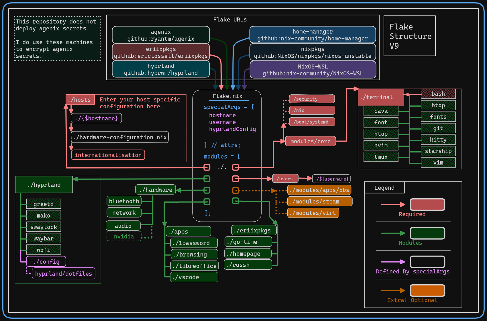
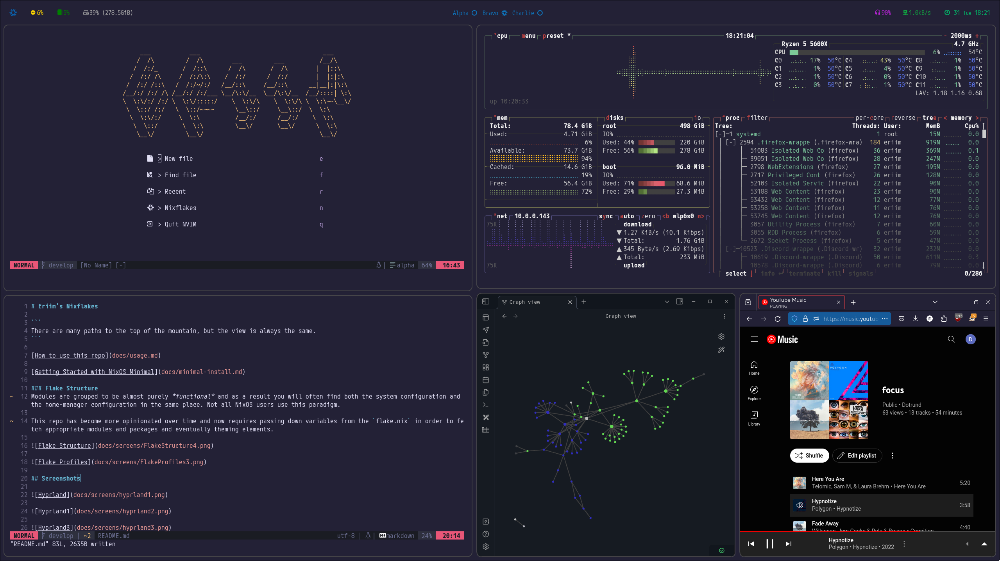
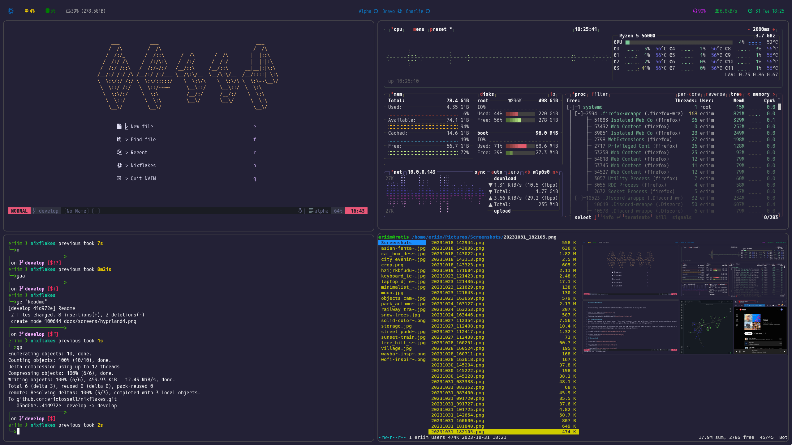
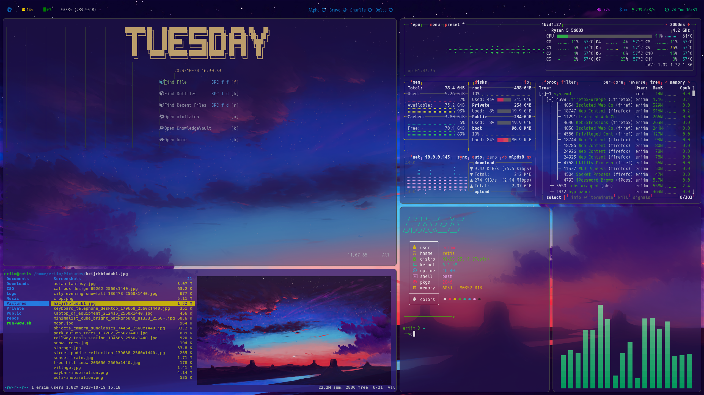
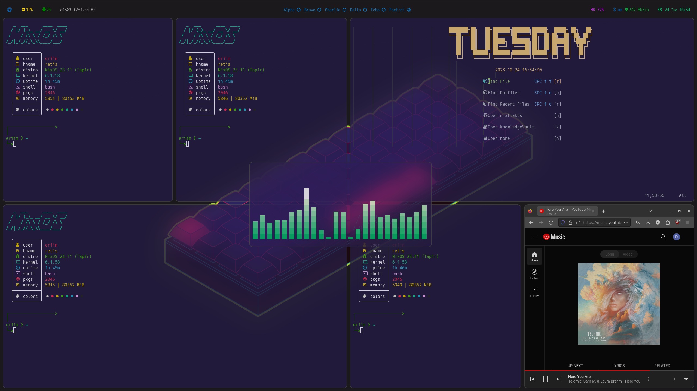
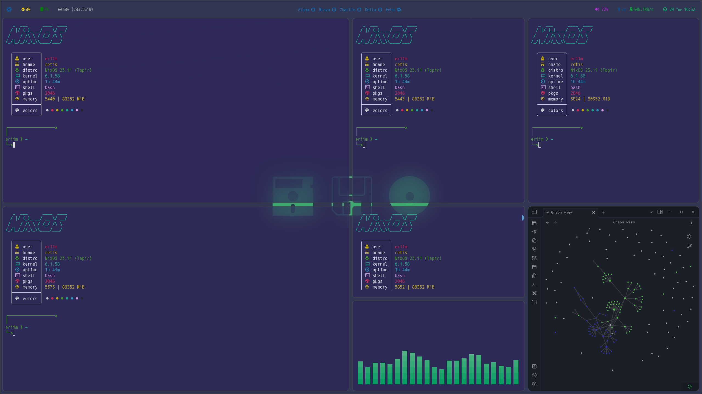

> :warning: **I am not an authority on `Nix` or `NixOS`. I am merely an apprentice, an *Alice* navigating the *wonderland*. At least for now.**

So anyways. Here's my dots. I hope you like them.


# Eriim's Nixflakes

[](https://github.com/erictossell/nixflakes/actions/workflows/flake_check.yml)

```
There are many paths to the top of the mountain, but the view is always the same.
```

<details>
<summary> 📚 Docs </summary>

[Why Nix and NixOS](docs/why-nix.md)

[Getting Started with NixOS Minimal](docs/minimal-install.md)

[How to use this repo](docs/usage.md)

[NixOS as a Hypervisor](docs/hypervisor.md)

[Keybindings Implemented by this Configuration](docs/keybinds.md) 

If you have questions you are welcome to send them in the form of an [issue](https://github.com/erictossell/nixflakes/issues/new) or reach me at any of my other points of contact available on my [GitHub Profile](https://github.com/erictossell) - I make no guarantees but I'm happy to do my best.

</details>

<details>
<summary>📁 What is in this repo?</summary>

1. A [modular](https://github.com/erictossell/nixflakes/blob/main/docs/screens/FlakeStructure9.png) (opinionated) Configuration Structure

2. Flake templates - Quickly grab this configuration and make it your own with:

```nix
nix flake new -t github:erictossell/nixflakes ./<your-repo-name-here>
```

3. An interactive build script for adding new [`hosts`](https://github.com/erictossell/nixflakes/tree/main/hosts)/[`users`](https://github.com/erictossell/nixflakes/tree/main/users) at [`sh/build.sh`](https://github.com/erictossell/nixflakes/blob/main/sh/build.sh)

4. [`eriixvim`](https://github.com/erictossell/eriixvim) - a fully reproducible neovim configuration built with [`nixvim`](https://github.com/nix-community/nixvim).

Try it out with:

```nix
nix run github:erictossell/eriixvim
```

5. A simple example of a custom built `rust` package: [`russh`](https://github.com/erictossell/russh). 

The highlight being how simple it is to package any application with `flakes` and import them into a `configuration` and ***not*** my `rust` code.

6. Semi up-to-date diagrams of the [structure](https://github.com/erictossell/nixflakes/blob/main/docs/screens/FlakeStructure9.png) of this flake and the [configurations](https://github.com/erictossell/nixflakes/blob/main/docs/screens/FlakeProfiles9.png) managed by [me](https://github.com/erictossell).


7. [Nix CI/CD with Github Actions](https://github.com/erictossell/nixflakes/blob/main/.github/workflows/flake_check.yml) - Built with: [Cachix - Install Nix](https://github.com/cachix/install-nix-action), [Determiniate Systems - Flake Check](https://github.com/DeterminateSystems/flake-checker-action), [stefanzweifel - Commit Action](https://github.com/stefanzweifel/git-auto-commit-action), [statix](https://github.com/nerdypepper/statix), [nixpkgs-fmt](https://github.com/nix-community/nixpkgs-fmt)

</details>

## Flake Structure
Modules are grouped to be ***almost*** purely *functional* and as a result you will often find both the system configuration and the home-manager configuration in the same place. Not all NixOS users use this paradigm.

This repo has become more opinionated over time and now requires passing down variables from the `flake.nix` in order to fetch appropriate `host` and `user` specific configurations for a given device.

<details>
<summary> Generated Flake Information </summary>


### Flake Info

```nix
Resolved URL:  git+file:///home/runner/work/nixflakes/nixflakes?shallow=1
Locked URL:    git+file:///home/runner/work/nixflakes/nixflakes?shallow=1
Description:   Eriim's machine specific configuration flake.
Path:          /nix/store/24nqs9wnfxhj3l6hxa2z298xyqq1b15g-source
Revision:      ca3abc113ecd7cdb010a0c17422a6f0aed0d4b32-dirty
Last modified: 2025-11-23 20:03:31
Inputs:
├───NixOS-WSL: github:nix-community/NixOS-WSL/3bcc267c4e0efa023b98b9c5cfbe11b88ec2dc8f (2025-11-21 15:14:21)
│   ├───flake-compat: github:edolstra/flake-compat/f387cd2afec9419c8ee37694406ca490c3f34ee5 (2025-10-27 18:09:55)
│   └───nixpkgs follows input 'nixpkgs'
├───agenix: github:ryantm/agenix/fcdea223397448d35d9b31f798479227e80183f6 (2025-11-08 16:12:14)
│   ├───darwin follows input ''
│   ├───home-manager: github:nix-community/home-manager/abfad3d2958c9e6300a883bd443512c55dfeb1be (2025-04-24 11:40:11)
│   │   └───nixpkgs follows input 'agenix/nixpkgs'
│   ├───nixpkgs follows input 'nixpkgs'
│   └───systems: github:nix-systems/default/da67096a3b9bf56a91d16901293e51ba5b49a27e (2023-04-09 08:27:08)
├───disko: github:nix-community/disko/ff442f5d1425feb86344c028298548024f21256d (2025-05-08 18:14:14)
│   └───nixpkgs follows input 'nixpkgs'
├───eriixpkgs: github:erictossell/eriixpkgs/adffe3633dc10e8ea0bf74e4078e6c24f0ce4822 (2025-11-23 16:46:48)
│   ├───eriixvim: github:erictossell/eriixvim/ba5c44cc9352a672290952bce5ca06eb44c88a9e (2025-11-23 16:45:37)
│   │   ├───flake-parts: github:hercules-ci/flake-parts/2cccadc7357c0ba201788ae99c4dfa90728ef5e0 (2025-11-21 21:04:27)
│   │   │   └───nixpkgs-lib: github:nix-community/nixpkgs.lib/719359f4562934ae99f5443f20aa06c2ffff91fc (2025-10-29 19:18:59)
│   │   ├───nixpkgs: github:nixos/nixpkgs/117cc7f94e8072499b0a7aa4c52084fa4e11cc9b (2025-11-20 22:45:58)
│   │   └───nixvim: github:nix-community/nixvim/2606dc719488065e735ff0fc622d743566b21ad4 (2025-11-22 13:59:25)
│   │       ├───flake-parts: github:hercules-ci/flake-parts/2cccadc7357c0ba201788ae99c4dfa90728ef5e0 (2025-11-21 21:04:27)
│   │       │   └───nixpkgs-lib follows input 'eriixpkgs/eriixvim/nixvim/nixpkgs'
│   │       ├───nixpkgs: github:NixOS/nixpkgs/a8d610af3f1a5fb71e23e08434d8d61a466fc942 (2025-11-20 06:07:48)
│   │       ├───nuschtosSearch: github:NuschtOS/search/e29de6db0cb3182e9aee75a3b1fd1919d995d85b (2025-10-29 09:40:56)
│   │       │   ├───flake-utils: github:numtide/flake-utils/11707dc2f618dd54ca8739b309ec4fc024de578b (2024-11-13 21:27:16)
│   │       │   │   └───systems: github:nix-systems/default/da67096a3b9bf56a91d16901293e51ba5b49a27e (2023-04-09 08:27:08)
│   │       │   ├───ixx: github:NuschtOS/ixx/babfe85a876162c4acc9ab6fb4483df88fa1f281 (2025-08-10 21:16:21)
│   │       │   │   ├───flake-utils follows input 'eriixpkgs/eriixvim/nixvim/nuschtosSearch/flake-utils'
│   │       │   │   └───nixpkgs follows input 'eriixpkgs/eriixvim/nixvim/nuschtosSearch/nixpkgs'
│   │       │   └───nixpkgs follows input 'eriixpkgs/eriixvim/nixvim/nixpkgs'
│   │       └───systems: github:nix-systems/default/da67096a3b9bf56a91d16901293e51ba5b49a27e (2023-04-09 08:27:08)
│   ├───flake-utils: github:numtide/flake-utils/11707dc2f618dd54ca8739b309ec4fc024de578b (2024-11-13 21:27:16)
│   │   └───systems: github:nix-systems/default/da67096a3b9bf56a91d16901293e51ba5b49a27e (2023-04-09 08:27:08)
│   ├───go-time: github:erictossell/go-time/f6fde276a99e8f19ed1e3d5b0f4946383eb4bc35 (2024-07-14 13:24:29)
│   │   └───nixpkgs: github:NixOS/nixpkgs/7e7c39ea35c5cdd002cd4588b03a3fb9ece6fad9 (2024-07-12 07:14:11)
│   ├───homepage-nix: github:erictossell/homepage-nix/540adeb9f307826c9bdd1b047a8b4467160709a4 (2024-07-05 04:49:49)
│   │   ├───naersk: github:nix-community/naersk/941ce6dc38762a7cfb90b5add223d584feed299b (2024-06-18 16:21:15)
│   │   │   └───nixpkgs: path:/nix/store/dk2rpyb6ndvfbf19bkb2plcz5y3k8i5v-source?lastModified=0&narHash=sha256-rwz8NJZV%2B387rnWpTYcXaRNvzUSnnF9aHONoJIYmiUQ%3D (1970-01-01 00:00:00)
│   │   ├───nixpkgs: github:NixOS/nixpkgs/1afc5440469f94e7ed26e8648820971b102afdc3 (2024-07-04 10:07:58)
│   │   └───utils: github:numtide/flake-utils/b1d9ab70662946ef0850d488da1c9019f3a9752a (2024-03-11 08:33:50)
│   │       └───systems: github:nix-systems/default/da67096a3b9bf56a91d16901293e51ba5b49a27e (2023-04-09 08:27:08)
│   ├───nixpkgs follows input 'nixpkgs'
│   ├───readme-py: github:erictossell/readme-py/a8102fee777bef93174b98806e9c876131583d00 (2025-11-23 00:17:19)
│   │   ├───flake-utils: github:numtide/flake-utils/11707dc2f618dd54ca8739b309ec4fc024de578b (2024-11-13 21:27:16)
│   │   │   └───systems: github:nix-systems/default/da67096a3b9bf56a91d16901293e51ba5b49a27e (2023-04-09 08:27:08)
│   │   ├───nixpkgs: github:NixOS/nixpkgs/117cc7f94e8072499b0a7aa4c52084fa4e11cc9b (2025-11-20 22:45:58)
│   │   └───poetry2nix: github:nix-community/poetry2nix/ce2369db77f45688172384bbeb962bc6c2ea6f94 (2025-04-03 14:27:04)
│   │       ├───flake-utils: github:numtide/flake-utils/c1dfcf08411b08f6b8615f7d8971a2bfa81d5e8a (2024-09-17 08:14:13)
│   │       │   └───systems: github:nix-systems/default/da67096a3b9bf56a91d16901293e51ba5b49a27e (2023-04-09 08:27:08)
│   │       ├───nix-github-actions: github:nix-community/nix-github-actions/e04df33f62cdcf93d73e9a04142464753a16db67 (2024-10-24 04:09:24)
│   │       │   └───nixpkgs follows input 'eriixpkgs/readme-py/poetry2nix/nixpkgs'
│   │       ├───nixpkgs follows input 'eriixpkgs/readme-py/nixpkgs'
│   │       ├───systems: github:nix-systems/default/da67096a3b9bf56a91d16901293e51ba5b49a27e (2023-04-09 08:27:08)
│   │       └───treefmt-nix: github:numtide/treefmt-nix/9ef337e492a5555d8e17a51c911ff1f02635be15 (2024-10-28 13:05:26)
│   │           └───nixpkgs follows input 'eriixpkgs/readme-py/poetry2nix/nixpkgs'
│   └───russh: github:erictossell/russh/45da95e1260fe25cd7145a23e4111d84b5b8ef7f (2024-07-05 04:45:21)
│       ├───naersk: github:nix-community/naersk/941ce6dc38762a7cfb90b5add223d584feed299b (2024-06-18 16:21:15)
│       │   └───nixpkgs: path:/nix/store/dk2rpyb6ndvfbf19bkb2plcz5y3k8i5v-source?lastModified=0&narHash=sha256-rwz8NJZV%2B387rnWpTYcXaRNvzUSnnF9aHONoJIYmiUQ%3D (1970-01-01 00:00:00)
│       ├───nixpkgs: github:NixOS/nixpkgs/1afc5440469f94e7ed26e8648820971b102afdc3 (2024-07-04 10:07:58)
│       └───utils: github:numtide/flake-utils/b1d9ab70662946ef0850d488da1c9019f3a9752a (2024-03-11 08:33:50)
│           └───systems: github:nix-systems/default/da67096a3b9bf56a91d16901293e51ba5b49a27e (2023-04-09 08:27:08)
├───home-manager: github:nix-community/home-manager/3d6c1c8fa0bea3a1a7ba23d6fa5993116766073b (2025-11-23 14:04:53)
│   └───nixpkgs follows input 'nixpkgs'
├───hyprland: git+https://github.com/hyprwm/Hyprland?ref=refs/heads/main&rev=2b0fd417d32278159d0ca1d23fb997588c37995b&submodules=1 (2025-11-23 15:48:15)
│   ├───aquamarine: github:hyprwm/aquamarine/6d0b3567584691bf9d8fedb5d0093309e2f979c7 (2025-11-05 15:31:59)
│   │   ├───hyprutils follows input 'hyprland/hyprutils'
│   │   ├───hyprwayland-scanner follows input 'hyprland/hyprwayland-scanner'
│   │   ├───nixpkgs follows input 'hyprland/nixpkgs'
│   │   └───systems follows input 'hyprland/systems'
│   ├───hyprcursor: github:hyprwm/hyprcursor/44e91d467bdad8dcf8bbd2ac7cf49972540980a5 (2025-07-31 12:14:09)
│   │   ├───hyprlang follows input 'hyprland/hyprlang'
│   │   ├───nixpkgs follows input 'hyprland/nixpkgs'
│   │   └───systems follows input 'hyprland/systems'
│   ├───hyprgraphics: github:hyprwm/hyprgraphics/ffc999d980c7b3bca85d3ebd0a9fbadf984a8162 (2025-11-06 20:47:32)
│   │   ├───hyprutils follows input 'hyprland/hyprutils'
│   │   ├───nixpkgs follows input 'hyprland/nixpkgs'
│   │   └───systems follows input 'hyprland/systems'
│   ├───hyprland-guiutils: github:hyprwm/hyprland-guiutils/66356e20a8ed348aa49c1b9ceace786e224225b3 (2025-11-10 06:13:06)
│   │   ├───aquamarine follows input 'hyprland/aquamarine'
│   │   ├───hyprgraphics follows input 'hyprland/hyprgraphics'
│   │   ├───hyprlang follows input 'hyprland/hyprlang'
│   │   ├───hyprtoolkit: github:hyprwm/hyprtoolkit/88483bdee5329ec985f0c8f834c519cd18cfe532 (2025-11-06 21:15:29)
│   │   │   ├───aquamarine follows input 'hyprland/hyprland-guiutils/aquamarine'
│   │   │   ├───hyprgraphics follows input 'hyprland/hyprland-guiutils/hyprgraphics'
│   │   │   ├───hyprlang follows input 'hyprland/hyprland-guiutils/hyprlang'
│   │   │   ├───hyprutils follows input 'hyprland/hyprland-guiutils/hyprutils'
│   │   │   ├───hyprwayland-scanner follows input 'hyprland/hyprland-guiutils/hyprwayland-scanner'
│   │   │   ├───nixpkgs follows input 'hyprland/hyprland-guiutils/nixpkgs'
│   │   │   └───systems follows input 'hyprland/hyprland-guiutils/systems'
│   │   ├───hyprutils follows input 'hyprland/hyprutils'
│   │   ├───hyprwayland-scanner follows input 'hyprland/hyprwayland-scanner'
│   │   ├───nixpkgs follows input 'hyprland/nixpkgs'
│   │   └───systems follows input 'hyprland/systems'
│   ├───hyprland-protocols: github:hyprwm/hyprland-protocols/bd153e76f751f150a09328dbdeb5e4fab9d23622 (2025-10-04 20:37:23)
│   │   ├───nixpkgs follows input 'hyprland/nixpkgs'
│   │   └───systems follows input 'hyprland/systems'
│   ├───hyprlang: github:hyprwm/hyprlang/deea98d5b61d066bdc7a68163edd2c4bd28d3a6b (2025-11-16 00:51:32)
│   │   ├───hyprutils follows input 'hyprland/hyprutils'
│   │   ├───nixpkgs follows input 'hyprland/nixpkgs'
│   │   └───systems follows input 'hyprland/systems'
│   ├───hyprutils: github:hyprwm/hyprutils/0c6411851cc779d551edc89b83966696201611aa (2025-11-16 20:02:11)
│   │   ├───nixpkgs follows input 'hyprland/nixpkgs'
│   │   └───systems follows input 'hyprland/systems'
│   ├───hyprwayland-scanner: github:hyprwm/hyprwayland-scanner/b3b0f1f40ae09d4447c20608e5a4faf8bf3c492d (2025-08-14 15:16:42)
│   │   ├───nixpkgs follows input 'hyprland/nixpkgs'
│   │   └───systems follows input 'hyprland/systems'
│   ├───nixpkgs: github:NixOS/nixpkgs/50a96edd8d0db6cc8db57dab6bb6d6ee1f3dc49a (2025-11-16 09:02:56)
│   ├───pre-commit-hooks: github:cachix/git-hooks.nix/7275fa67fbbb75891c16d9dee7d88e58aea2d761 (2025-11-16 19:04:02)
│   │   ├───flake-compat: github:edolstra/flake-compat/9100a0f413b0c601e0533d1d94ffd501ce2e7885 (2025-05-12 10:39:32)
│   │   ├───gitignore: github:hercules-ci/gitignore.nix/637db329424fd7e46cf4185293b9cc8c88c95394 (2024-02-28 02:28:52)
│   │   │   └───nixpkgs follows input 'hyprland/pre-commit-hooks/nixpkgs'
│   │   └───nixpkgs follows input 'hyprland/nixpkgs'
│   ├───systems: github:nix-systems/default-linux/31732fcf5e8fea42e59c2488ad31a0e651500f68 (2023-07-14 15:19:09)
│   └───xdph: github:hyprwm/xdg-desktop-portal-hyprland/4b8801228ff958d028f588f0c2b911dbf32297f9 (2025-10-25 22:26:18)
│       ├───hyprland-protocols follows input 'hyprland/hyprland-protocols'
│       ├───hyprlang follows input 'hyprland/hyprlang'
│       ├───hyprutils follows input 'hyprland/hyprutils'
│       ├───hyprwayland-scanner follows input 'hyprland/hyprwayland-scanner'
│       ├───nixpkgs follows input 'hyprland/nixpkgs'
│       └───systems follows input 'hyprland/systems'
├───hyprlock: github:hyprwm/hyprlock/98b86752fe4867bd14ef96a92ea788229af93130 (2025-10-28 18:20:34)
│   ├───hyprgraphics: github:hyprwm/hyprgraphics/9431db625cd9bb66ac55525479dce694101d6d7a (2025-10-03 11:18:12)
│   │   ├───hyprutils follows input 'hyprlock/hyprutils'
│   │   ├───nixpkgs follows input 'hyprlock/nixpkgs'
│   │   └───systems follows input 'hyprlock/systems'
│   ├───hyprlang: github:hyprwm/hyprlang/4dafa28d4f79877d67a7d1a654cddccf8ebf15da (2025-09-26 23:05:02)
│   │   ├───hyprutils follows input 'hyprlock/hyprutils'
│   │   ├───nixpkgs follows input 'hyprlock/nixpkgs'
│   │   └───systems follows input 'hyprlock/systems'
│   ├───hyprutils: github:hyprwm/hyprutils/3df7bde01efb3a3e8e678d1155f2aa3f19e177ef (2025-10-04 23:12:03)
│   │   ├───nixpkgs follows input 'hyprlock/nixpkgs'
│   │   └───systems follows input 'hyprlock/systems'
│   ├───hyprwayland-scanner: github:hyprwm/hyprwayland-scanner/b3b0f1f40ae09d4447c20608e5a4faf8bf3c492d (2025-08-14 15:16:42)
│   │   ├───nixpkgs follows input 'hyprlock/nixpkgs'
│   │   └───systems follows input 'hyprlock/systems'
│   ├───nixpkgs follows input 'nixpkgs'
│   └───systems: github:nix-systems/default-linux/31732fcf5e8fea42e59c2488ad31a0e651500f68 (2023-07-14 15:19:09)
├───hyprpicker: github:hyprwm/hyprpicker/5ab0e1aaa489ceb807c884a73b4948d395d9e229 (2025-11-06 00:25:41)
│   ├───hyprutils: github:hyprwm/hyprutils/e36db00dfb3a3d3fdcc4069cb292ff60d2699ccb (2025-06-05 14:55:56)
│   │   ├───nixpkgs follows input 'hyprpicker/nixpkgs'
│   │   └───systems follows input 'hyprpicker/systems'
│   ├───hyprwayland-scanner: github:hyprwm/hyprwayland-scanner/817918315ea016cc2d94004bfb3223b5fd9dfcc6 (2025-06-05 17:49:20)
│   │   ├───nixpkgs follows input 'hyprpicker/nixpkgs'
│   │   └───systems follows input 'hyprpicker/systems'
│   ├───nixpkgs follows input 'nixpkgs'
│   └───systems: github:nix-systems/default-linux/31732fcf5e8fea42e59c2488ad31a0e651500f68 (2023-07-14 15:19:09)
├───nixpkgs: github:NixOS/nixpkgs/117cc7f94e8072499b0a7aa4c52084fa4e11cc9b (2025-11-20 22:45:58)
└───stylix: github:danth/stylix/adc650610085adbe130b9860d5bdb869f96050af (2025-11-22 20:59:01)
    ├───base16: github:SenchoPens/base16.nix/75ed5e5e3fce37df22e49125181fa37899c3ccd6 (2025-08-21 23:34:00)
    │   └───fromYaml: github:SenchoPens/fromYaml/106af9e2f715e2d828df706c386a685698f3223b (2024-11-18 21:47:06)
    ├───base16-fish: github:tomyun/base16-fish/23ae20a0093dca0d7b39d76ba2401af0ccf9c561 (2025-08-05 14:56:24)
    ├───base16-helix: github:tinted-theming/base16-helix/27cf1e66e50abc622fb76a3019012dc07c678fac (2025-07-20 02:44:11)
    ├───base16-vim: github:tinted-theming/base16-vim/577fe8125d74ff456cf942c733a85d769afe58b7 (2024-11-28 15:06:36)
    ├───firefox-gnome-theme: github:rafaelmardojai/firefox-gnome-theme/0909cfe4a2af8d358ad13b20246a350e14c2473d (2025-09-17 12:32:51)
    ├───flake-parts: github:hercules-ci/flake-parts/4524271976b625a4a605beefd893f270620fd751 (2025-09-01 23:46:52)
    │   └───nixpkgs-lib follows input 'stylix/nixpkgs'
    ├───gnome-shell: gitlab:GNOME/gnome-shell/680e3d195a92203f28d4bf8c6e8bb537cc3ed4ad (2025-11-11 13:50:44)
    ├───nixpkgs follows input 'nixpkgs'
    ├───nur: github:nix-community/NUR/ba8d9c98f5f4630bcb0e815ab456afd90c930728 (2025-09-27 18:43:00)
    │   ├───flake-parts follows input 'stylix/flake-parts'
    │   └───nixpkgs follows input 'stylix/nixpkgs'
    ├───systems: github:nix-systems/default/da67096a3b9bf56a91d16901293e51ba5b49a27e (2023-04-09 08:27:08)
    ├───tinted-foot: github:tinted-theming/tinted-foot/fd1b924b6c45c3e4465e8a849e67ea82933fcbe4 (2024-09-21 10:04:00)
    ├───tinted-kitty: github:tinted-theming/tinted-kitty/de6f888497f2c6b2279361bfc790f164bfd0f3fa (2025-01-01 11:21:37)
    ├───tinted-schemes: github:tinted-theming/schemes/317a5e10c35825a6c905d912e480dfe8e71c7559 (2025-09-12 22:32:13)
    ├───tinted-tmux: github:tinted-theming/tinted-tmux/d217ba31c846006e9e0ae70775b0ee0f00aa6b1e (2025-09-14 01:06:10)
    └───tinted-zed: github:tinted-theming/base16-zed/824fe0aacf82b3c26690d14e8d2cedd56e18404e (2025-09-14 00:54:07)

```

### Flake Outputs

```nix
git+file:///home/runner/work/nixflakes/nixflakes?shallow=1
├───devShells
│   └───x86_64-linux
│       └───default: development environment 'nix-shell'
├───formatter
│   └───x86_64-linux: package 'nixfmt-1.1.0'
├───nixosConfigurations
│   ├───arkhitekton: NixOS configuration
│   ├───et007: NixOS configuration
│   ├───live-image: NixOS configuration
│   ├───terminus: NixOS configuration
│   ├───virtualis: NixOS configuration
│   ├───vm-temp: NixOS configuration
│   └───winix: NixOS configuration
└───templates
    └───default: template: The default template for Eriim's nixflakes.

```


</details>


<details>
<summary>📊 Diagrams</summary>




</details> 

<details>
<summary>📸 Screenshots</summary>

Current 
------



October 2023
------






</details>

[How to use this repo](docs/usage.md)

[Getting Started with NixOS Minimal](docs/minimal-install.md)
